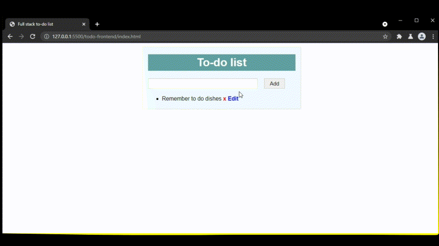
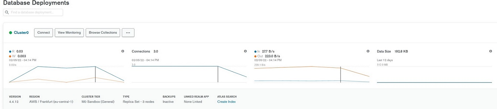
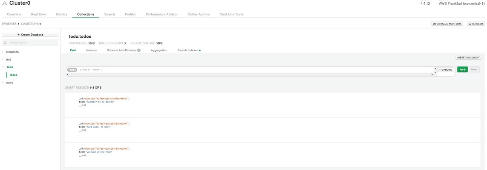
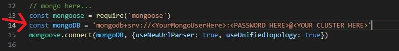
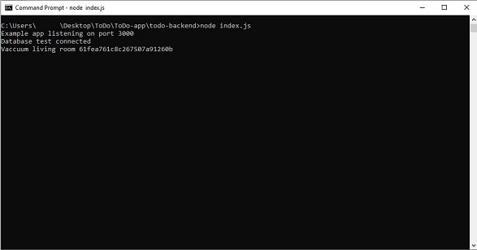
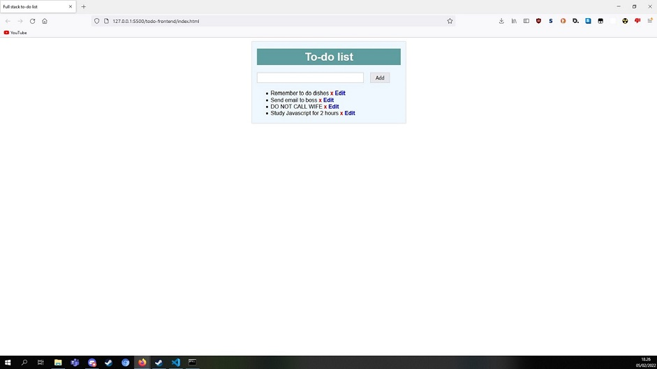

# ToDo webapp

A to-do list webapp for personal use, project management or whatever you can come up with. Thanks to MongoDB, it is now integrated to the *cloud*.  

## Description

A to-do list working on NodeJS, Express and MongoDB. It's designed to be lightweight, customizable and easy to use for personal and professional setting. Thanks to MongoDB cloud integration, none of the data will be saved on-site. 

  

**FEATURES** 

- Read, add, edit and delete jobs  
- Minimalistic and easily customizable front-end  
- Very lightweight  
- MongoDB cloud integration  

## MongoDB

Yes, that's right. Thanks to MongoDB cloud integration, you can add your to-do lists to your cloud environment! All of the data will be handled by MongoDB. Take advantage of MongoDB's vast array of monitoring, triggers and APIs to push your to-do listings to the next level!  

  

  

# How to install

1. [Install node](https://nodejs.org/en/download/), if you haven't already.  
2. Download this repository.  
3. Create a [MongoDB cloud database](https://www.mongodb.com/) (There is a free option!)  
4. Add your MongoDB cluster application connection string to todo-backend/index.js as shown in picture:

  

5. Run **todo-backend/index.js** with Node. This will start the backend and begin logging activities.  

  

6. Run a live server on the todo-frontend/index.html and visit your new to-do list web application!

  

### Credits

This project was created by [Herkko Mehtälä](https://github.com/Herkkomehtala)